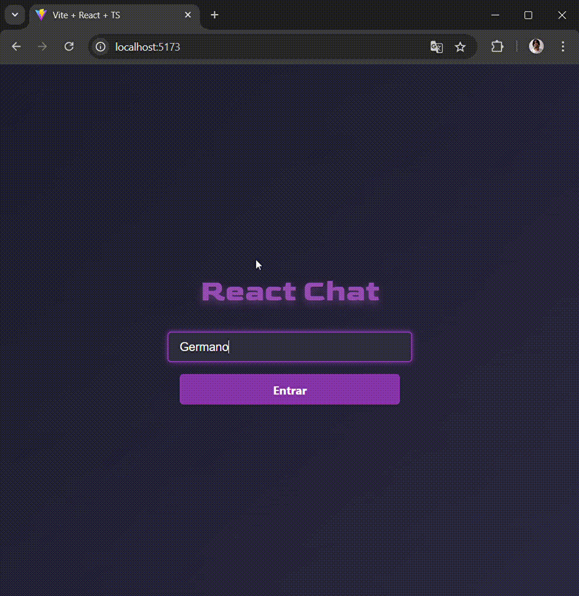

# React Chat com WebSocket, Redux, Router e Carousel


## Descrição
Chat em tempo real, construido o front-end em react, mostrando o uso do react-router-dom, redux, styled-components com animação para carousel de forma simples e prática.
Seu back-end para o servidor foi feito em nodejs, para receber localmente as mensagens, informações do usuário, como: quem entra e sai do chat, aviso de quem digita, e conexão rápida para o usuário.

## Informações adicionais
Foi utilizado o Vite para instalação do framework do front-end.

Versão do node v20.17.0

## Prévia




# Instalação
## Passo 1
Clone o projeto
```bash
git clone https://github.com/paulogermanopg/Chat_React_Node.git
```
## Passo 2
Instale os pacotes necessários tanto no diretório "/front" quanto no diretório "/back":
```bash
#use node =>18

#usando o npm
npm install

#usando o yarn (recomendado)
yarn install
```

## Passo 3
Abra dois terminais, um para o diretório "/front", e outro para o diretório "/back",
e executo o comando em ambos os terminais:
```bash
npm run dev
```
# Licença do MIT
Copyright (c) 2024 Paulo Germano

Permission is hereby granted, free of charge, to any person obtaining a copy
of this software and associated documentation files (the "Software"), to deal
in the Software without restriction, including without limitation the rights
to use, copy, modify, merge, publish, distribute, sublicense, and/or sell
copies of the Software, and to permit persons to whom the Software is
furnished to do so, subject to the following conditions:

The above copyright notice and this permission notice shall be included in all
copies or substantial portions of the Software.

THE SOFTWARE IS PROVIDED "AS IS", WITHOUT WARRANTY OF ANY KIND, EXPRESS OR
IMPLIED, INCLUDING BUT NOT LIMITED TO THE WARRANTIES OF MERCHANTABILITY,
FITNESS FOR A PARTICULAR PURPOSE AND NONINFRINGEMENT. IN NO EVENT SHALL THE
AUTHORS OR COPYRIGHT HOLDERS BE LIABLE FOR ANY CLAIM, DAMAGES OR OTHER
LIABILITY, WHETHER IN AN ACTION OF CONTRACT, TORT OR OTHERWISE, ARISING FROM,
OUT OF OR IN CONNECTION WITH THE SOFTWARE OR THE USE OR OTHER DEALINGS IN THE
SOFTWARE.
